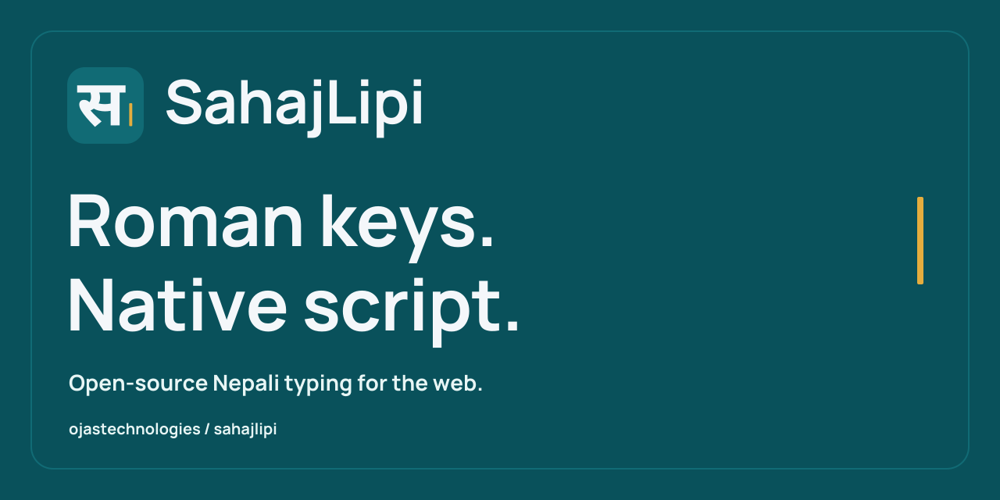

# SahajLipi brand assets

<picture>
  <source media="(prefers-color-scheme: dark)" srcset="logo-dark.svg">
  
</picture>

Use the [brand guide](../../docs/brand.md) for naming, colors, spacing, copy and accessible image use. SVG artwork is the source of truth; PNG and ICO files are exports for services and browsers that need raster images.

## Asset inventory

| File | Format / size | Purpose |
| --- | --- | --- |
| [`mark.svg`](mark.svg) | SVG, 100 × 100 viewBox | Devanagari स and caret mark. |
| [`logo.svg`](logo.svg) | SVG, 520 × 112 viewBox | Primary horizontal logo for light backgrounds. |
| [`logo.png`](logo.png) | PNG, 520 × 112 | Raster primary logo. |
| [`logo-dark.svg`](logo-dark.svg) | SVG, 520 × 112 viewBox | Horizontal logo for dark backgrounds. |
| [`logo-mono.svg`](logo-mono.svg) | SVG, 520 × 112 viewBox | Single-color horizontal logo. |
| [`wordmark.svg`](wordmark.svg) | SVG, 380 × 112 viewBox | SahajLipi wordmark without the mark. |
| [`avatar.png`](avatar.png) | PNG, 512 × 512 | Square project identity. |
| [`favicon.svg`](favicon.svg) | SVG, 100 × 100 viewBox | Browser icon. |
| [`favicon-32.png`](favicon-32.png) | PNG, 32 × 32 | Raster browser icon. |
| [`favicon.ico`](favicon.ico) | ICO, 16 / 32 / 48-pixel frames | Browser fallback. |
| [`apple-touch-icon.png`](apple-touch-icon.png) | PNG, 180 × 180 | Apple touch icon. |
| [`icon-192.png`](icon-192.png) | PNG, 192 × 192 | Application icon export. |
| [`icon-512.png`](icon-512.png) | PNG, 512 × 512 | Application icon export. |
| [`social-preview.svg`](social-preview.svg) | SVG, 1280 × 640 | Editable social preview source. |
| [`social-preview.png`](social-preview.png) | PNG, 1280 × 640 | GitHub social preview upload; under 1 MB. |
| [`brand-sheet.svg`](brand-sheet.svg) | SVG, 1600 × 1020 | Editable visual overview. |
| [`brand-sheet.png`](brand-sheet.png) | PNG, 1600 × 1020 | Visual overview. |



## Sources and editing

The logo contains outlined glyphs from Noto Sans Devanagari Bold and Manrope Bold. It has no external font requests or embedded font files. The [manifest](manifest.json) records the pinned Google Fonts revision, source URLs, SHA-256 hashes, glyph and export details. Font source attribution is retained in the [Noto Sans Devanagari notice](licenses/notosansdevanagari-OFL.txt) and [Manrope notice](licenses/manrope-OFL.txt). Keep these records when updating the artwork; generated SVG outlines are artwork, rather than redistributed font software.

Edit the SVG masters, preserve their viewBox and aspect ratio, and refresh the affected PNG / ICO exports. For changes that must survive a full rebuild, update the layout in [`generate-brand-assets.py`](../../scripts/generate-brand-assets.py) and the palette in the manifest as well. Keep export dimensions explicit. Before committing, inspect the mark at 24 pixels and the favicons at 16 / 32 pixels, verify dark-background contrast, and confirm that the social preview remains 1280 × 640 and below 1 MB. Keep the inventory and source records synchronized with the files.

The original artwork follows the repository's [MIT license](../../LICENSE). The guidelines describe consistent identity use without adding license restrictions.

## Rebuild the exports

Run these commands from the repository root. The optional design tools require Python 3.9+ and Node.js 20.9+; they are installed outside the checkout and are not package runtime dependencies.

```sh
python3 -m venv /tmp/sahajlipi-brand-tools/python
/tmp/sahajlipi-brand-tools/python/bin/python -m pip install fonttools==4.60.1
npm install --prefix /tmp/sahajlipi-brand-tools/node sharp@0.35.4
```

Download the exact font sources recorded in the manifest. This example checks their SHA-256 hashes and stores them outside the repository:

```sh
python3 - <<'PYFONT'
import hashlib
import json
from pathlib import Path
from urllib.request import urlopen

manifest = json.loads(Path('assets/brand/manifest.json').read_text())
font_dir = Path('/tmp/sahajlipi-brand-tools/fonts')
font_dir.mkdir(parents=True, exist_ok=True)
for name, record in zip(('noto-deva.ttf', 'manrope.ttf'), manifest['fonts']):
    with urlopen(record['sourceUrl']) as response:
        data = response.read()
    if hashlib.sha256(data).hexdigest() != record['sourceSha256']:
        raise ValueError('Font source hash differs: ' + record['family'])
    (font_dir / name).write_bytes(data)
PYFONT
```

Regenerate the SVG masters, then their raster exports:

```sh
/tmp/sahajlipi-brand-tools/python/bin/python scripts/generate-brand-assets.py --font-dir /tmp/sahajlipi-brand-tools/fonts
NODE_PATH=/tmp/sahajlipi-brand-tools/node/node_modules node scripts/render-brand-assets.mjs
```

The [SVG generator](../../scripts/generate-brand-assets.py) checks the font hashes before outlining the glyphs. The [raster generator](../../scripts/render-brand-assets.mjs) exports PNGs and ICO frames, updates the asset manifest, and checks the social preview's size. Review the resulting artwork before committing. The current social preview is **45,064 bytes**.

## GitHub upload

Open [repository Settings](https://github.com/ojastechnologies/sahajlipi/settings), then **Social preview → Edit → Upload an image…** and upload [`social-preview.png`](social-preview.png) from this folder. The organization avatar is shared organizational identity; this image is for the repository preview. Refer to [GitHub's instructions](https://docs.github.com/en/repositories/managing-your-repositorys-settings-and-features/customizing-your-repository/customizing-your-repositorys-social-media-preview) for accepted file formats and sizes.
