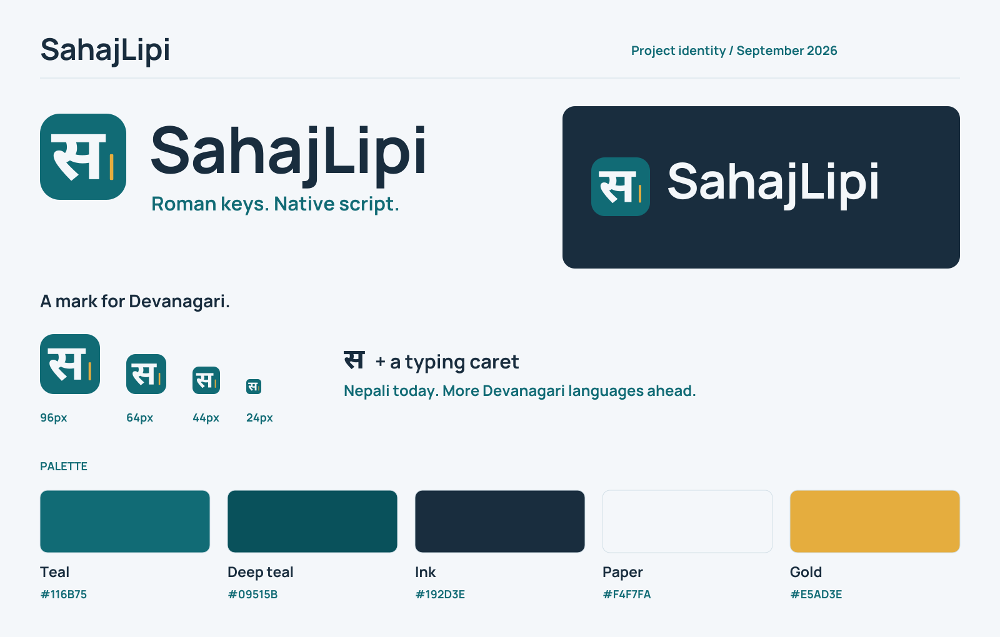

# SahajLipi brand guide

<picture>
  <source media="(prefers-color-scheme: dark)" srcset="../assets/brand/logo-dark.svg">
  
</picture>

SahajLipi helps people type Nepali with Roman keys in web applications. Its identity combines a Devanagari **स** mark, a typing caret, and a clear Latin wordmark. The letter begins **सहज** (Sahaj) and belongs to the Devanagari script shared by several languages. This gives the identity room to grow as the project develops additional language profiles.

## Name and message

| Item | Use |
| --- | --- |
| Display name | **SahajLipi** — one word, capital S and L. |
| Repository and package identifier | `sahajlipi` — lowercase. |
| Tagline | **Roman keys. Native script.** |
| Supporting line | **Open-source Nepali typing for the web.** |
| Current product description | Open-source JavaScript library with TypeScript declarations for Roman Nepali to Unicode typing; an experimental Nepali developer alpha available on npm, with a website and demo. |

Use plain, specific language. Explain the keys, the resulting script, and the next action. In issue reports and release notes, show an actual input and output. Keep buttons direct: “Copy”, “Clear”, and “Try the demo”.

Describe Nepali as the implemented language today. Other Devanagari languages are a [future goal](status-and-roadmap.md#priorities). The broad tagline describes the typing idea; surrounding copy must still state the current Nepali scope. Claims about accuracy, browser support, privacy, or comparisons with other tools need linked evidence and its limits. The verified npm release is `0.1.0-alpha.2`, an experimental Nepali developer alpha published on 2026-10-03. Label it as an alpha and show the exact install command `npm install --save-exact sahajlipi@0.1.0-alpha.2`; publication does not establish stable APIs or linguistic quality. Use the [release record](release.md), [status page](status-and-roadmap.md), and [evaluation guides](package/benchmarks.md) for current claims.

## Logo and mark

The **स** and caret form the mark. The Latin **SahajLipi** wordmark makes the project name readable across developer communities. Use the supplied artwork rather than typing the name in a similar font or rebuilding the letter.

| Asset | Use |
| --- | --- |
| [Primary logo](../assets/brand/logo.svg) | README, light website headers, documentation and presentations. |
| [Dark-background logo](../assets/brand/logo-dark.svg) | Deep teal or ink backgrounds; the wordmark is light. |
| [Monochrome logo](../assets/brand/logo-mono.svg) | Single-color reproduction on light backgrounds. |
| [Mark](../assets/brand/mark.svg) | Compact UI, icons and spaces where the project name is already visible. |
| [Wordmark](../assets/brand/wordmark.svg) | Text identity when the mark is already present nearby. |
| [Avatar](../assets/brand/avatar.png) | Square project identity on services that offer a project-specific avatar. |
| [Social preview](../assets/brand/social-preview.png) | GitHub repository link previews, 1280 × 640 pixels. |
| [Brand sheet](../assets/brand/brand-sheet.png) | A quick visual reference for the identity and palette. |

### Size and spacing

Keep at least **24% of the mark width** clear around the visible logo or mark, measured from the artwork to nearby text, borders or other graphics. For a 100-pixel mark, leave 24 pixels on every side. Preserve the spacing within the supplied lockup.

| Variant | Recommended minimum display width |
| --- | --- |
| Full logo | 180 CSS pixels |
| Wordmark | 140 CSS pixels |
| Standalone mark | 24 CSS pixels |
| Browser favicon | Use the dedicated favicon exports at 16 or 32 pixels. |

Scale proportionally. Retain the supplied shapes, colors and caret placement. Use a calm, solid background with clear contrast; keep the logo separate from busy imagery. At small sizes, use the mark instead of shrinking the full wordmark. Confirm that an avatar's crop leaves the entire letter and caret visible.

### Accessible identity

Use `alt="SahajLipi"` for a logo that identifies the project. Use `alt=""` when the same project name appears immediately alongside it and the image is decorative. A logo linking to the home page needs an accessible link name such as “SahajLipi home”. Describe informational artwork, such as the social preview, with its message rather than its colors alone.

## Color

| Color | Hex | Role |
| --- | --- | --- |
| Teal | `#116B75` | Main identity, primary actions and links. |
| Deep teal | `#09515B` | Dark identity surfaces and emphasis. |
| Ink | `#192D3E` | Wordmark and body text on light surfaces. |
| Paper | `#F4F7FA` | Main light canvas. |
| Light teal | `#E8F6F5` | Quiet panels and supporting surfaces. |
| Gold | `#E5AD3E` | Typing caret and decorative accents. |

Use ink or teal for text on light surfaces. Gold highlights typing surfaces, active navigation, keyboard examples, and selected text. Pair bright gold (`#E5AD3E`) with ink text; use pale gold (`#FFF6E2`) behind dark labels and darker gold (`#8A5B0B`) for carets on light backgrounds. Dark-mode carets use bright gold. Input focus rings use the same bright gold (`#E5AD3E`) as the other highlights in both themes. Keep deep teal for button and link focus on light surfaces. Pair color with labels or shape to communicate state, and preserve readable text contrast.

## Typography

The outlined logo uses **Noto Sans Devanagari Bold (700)** for **स** and **Manrope Bold (700)** for **SahajLipi**. Its SVG paths keep the identity consistent without downloading fonts. Font source pins and notices belong with the [asset documentation](../assets/brand/README.md).

Interface and documentation text should use the existing readable system sans-serif stack, with Devanagari-capable fallbacks. Logo typefaces are an artwork choice; contributors do not need to load them into the demo. Keep body copy comfortably sized and preserve Unicode text as text wherever people need to select, search or copy it.

## GitHub repository identity

Use the logo in this repository's README and its social preview. GitHub's owner avatar represents the [organization profile](https://docs.github.com/en/organizations/collaborating-with-groups-in-organizations/customizing-your-organizations-profile); replacing it would change the Ojas Technologies identity across the organization.

The website metadata uses the supplied social preview. GitHub currently uses its default generated repository preview; a custom image has not been uploaded. To optionally install the repository preview, open [the repository settings](https://github.com/ojastechnologies/sahajlipi/settings), then **Social preview → Edit → Upload an image…** and select `assets/brand/social-preview.png` from your checkout. GitHub accepts PNG, JPG or GIF files under 1 MB and recommends 1280 × 640 pixels, with 640 × 320 as the minimum recommendation. See [GitHub's social preview instructions](https://docs.github.com/en/repositories/managing-your-repositorys-settings-and-features/customizing-your-repository/customizing-your-repositorys-social-media-preview).

## Package website identity

The package homepage and documentation use the same mark, wordmark, colors, and browser icons as the demo. Page previews use `assets/brand/social-preview.png`; preserve the meaningful project name in visible text and accessible image names. Page titles and descriptions live in `website/page-meta.json`, with the implemented Nepali scope and experimental developer alpha status stated plainly. The [website and SEO guide](website-and-seo.md) explains canonical URLs, social metadata, and repository discovery.

## Contributing artwork

Start from the SVG masters in [`assets/brand/`](../assets/brand/README.md). Keep the public name, mark, palette and aspect ratios consistent, then refresh all affected exports together. Inspect the light and dark logos, a 24-pixel mark, browser icons and the social preview at their actual display sizes. Check file paths and accessible names wherever assets are embedded.

Record source fonts, their licenses and any export changes in the asset documentation. The original project artwork and documentation use the repository's [MIT license](../LICENSE); the font sources retain their own SIL Open Font License notices. These consistency guidelines do not add restrictions to the MIT reuse terms.
