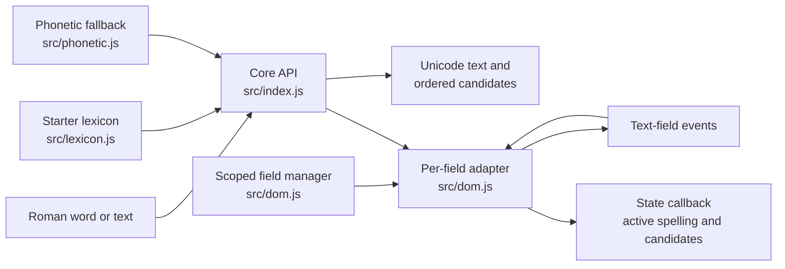

# Architecture

SahajLipi is currently a small, dependency-free **Nepali** transliteration prototype. A pure conversion engine chooses a default Devanagari rendering for Roman input; separate browser adapters apply that engine to configured text fields as the user types. The project name leaves room for other Devanagari languages, but no other language implementation exists today.

This page describes the code as it is implemented. For supported keys and examples, see the [typing reference](typing-reference.md). For evaluation methods and current results, see [benchmarks](benchmarks.md).

## Components and boundaries

| File | Responsibility |
| --- | --- |
| [`src/index.js`](../../src/index.js) | Public core API; lexicon lookup, explicit shortcut handling, candidate generation, and whole-text conversion. |
| [`src/lexicon.js`](../../src/lexicon.js) | Small, reviewable map of Roman spellings to preferred output and any alternatives. |
| [`src/phonetic.js`](../../src/phonetic.js) | Deterministic token-to-Devanagari fallback for words absent from the lexicon. |
| [`src/dom.js`](../../src/dom.js) | Optional text-field integration: scoped discovery and lifecycle, live replacement, caret and active-word state, suggestions, paste, composition, and undo. |
| [`src/index.d.ts`](../../src/index.d.ts), [`src/dom.d.ts`](../../src/dom.d.ts) | TypeScript declarations for the core and browser adapters. |

The core imports only the lexicon and phonetic modules. It does not access the DOM or make network requests. The browser module uses the default converters unless custom functions are passed, so an independent engine can drive the same input behavior. The package is an ES module with `.` and `./dom` export paths and no runtime dependencies; it currently has `private: true` and is **not published to npm** ([`package.json`](../../package.json)). Node.js 18 or newer is declared for development and tests.

## Core conversion flow

[`createEngine({ entries })`](../../src/index.js) returns an independent object with `convertWord` and `convertText`. Each engine clones the starter lexicon and replaces entries with the same normalized Roman key from `entries`. Each custom value must be a nonempty array of nonempty strings. A word's first value is its default output; later distinct values are alternatives. The module also exports `convertWord` and `convertText` from one default engine instance. Customizing an engine does not alter that default instance.

For `convertWord(roman)`, the order is:

1. **Normalize case.** Most capitals become lowercase. Capital `T`, `D`, `S`, and `R` retain distinct sound mappings. `H` remains capital after a Roman vowel so it can represent visarga. This is implemented in [`normalizeRoman`](../../src/phonetic.js).
2. **Try a whole-word lexicon entry.** An exact normalized key wins. Otherwise lookup tries its lowercase form, except when the normalized input contains `T` or `D`, which intentionally preserves the dental/retroflex distinction. This allows familiar capitalized entries such as `Ram` while retaining explicit shifted spellings. A custom entry can replace a built-in spelling or add alternatives.
3. **Handle explicit marks if no whole-word entry exists.** The word is split at `^`, `~`, `/`, and `=`. Each ordinary segment takes its preferred lexicon reading if present, or its phonetic fallback. `^` appends anusvara `ं`; `~` appends chandrabindu `ँ`. `/` requests virama `्` after a Devanagari consonant or keeps an existing trailing virama; otherwise it remains a literal slash. `=` inserts zero-width joiner U+200D only immediately after a slash-requested virama; otherwise it stays literal. Segment processing produces one candidate. A whole-word custom entry can still provide alternatives for a spelling containing shortcuts.
4. **Apply the phonetic fallback** when neither a whole-word entry nor explicit-shortcut path applies. Duplicate candidate strings are removed without changing their order. The result is `{ text, candidates, ambiguous }`, where `text` is the first candidate and `ambiguous` means more than one distinct candidate exists. Empty input returns empty text and candidates.

The fallback matches the longest available consonant or vowel token at each position ([`src/phonetic.js`](../../src/phonetic.js)). A consonant first emits its Unicode letter plus virama `्`, making an unvoweled consonant half by default: `k` → `क्`. A following vowel replaces the trailing virama with the appropriate dependent vowel sign; `a` supplies no sign, so `ka` → `क`. A vowel not following a consonant emits its independent letter. Consecutive consonants therefore form clusters: `kr` → `क्र्`, then `kra` → `क्र`. Characters with no matching token are copied through. This is a deterministic character rule, **not** a spelling model.

`convertText(text)` finds runs of ASCII Roman letters and shortcut characters, applies `convertWord` to each run, then maps every `|` to danda `।` ([`src/index.js`](../../src/index.js)). It preserves `.` (including decimal points), whitespace, digits, other punctuation, and existing Devanagari. It does not detect whether an ASCII word is English; an English word in a matching run can be transliterated.

### Word-level decisions and examples

The [starter lexicon](../../src/lexicon.js) handles spellings that simple phonetic rules would miss. For example, `pani` → `पनि` and `paani` → `पानी` are separate entries; `paryo` → `पर्‍यो` is a word-specific entry, not a general rule for every `ry`. `kam` defaults to `कम` and offers `काम` as an alternative. Unknown words fall back to phonetic conversion, which may be readable yet linguistically wrong. There is no context-sensitive candidate ranking or automatic learning.

## Browser input adapters

`attachNepaliInputs(root = document, options?)` creates a manager scoped to a document or container. Its default `scope: 'marked'` selects fields with `data-sahajlipi`; `scope: 'all'` selects every supported text field under that root. A custom `selector` replaces either selection rule. Matching `excludeSelector` fields are left untouched (default `[data-sahajlipi-ignore]`), so an app-wide manager can coexist with English fields on the same page. This is configuration on a manager instance; there is no mutable module-wide setting. Overlapping managers are rejected with `TypeError` to prevent double conversion. A document-wide scan does not enter shadow roots or iframe documents.

The manager attaches one controller per eligible field and watches changes with `MutationObserver`. A scan also removes controllers for fields that no longer qualify. `refresh()` scans on demand, `getController(field)` finds a managed field's controller, and `destroy()` disconnects observation and removes those controllers. `enabled` sets the initial mode of attached fields. `setEnabled(boolean)` updates every current controller and the default for fields added later; `getEnabled()` reads that shared mode. Shared conversion functions can be passed in `options`, and `onStateChange(state, field)` identifies the field behind a state update.

`attachNepaliInput(field, options?)` attaches a single `<textarea>`, `<input type="text">`, or `<input type="search">` and returns a controller with `getState`, `chooseCandidate`, `setEnabled`, `setText`, `insertPunctuation`, `insertMark`, `undo`, `redo`, and `destroy`. The default converters work without options; passing `convertWord` and `convertText` connects a custom engine. `enabled` chooses the initial mode for that one field. Its `onStateChange(state)` callback receives an initial state and later updates. Unsupported field types are ignored by the manager and rejected by the direct API. The adapter does not implement `contenteditable`.

The per-field adapter's **active word** records the Roman keys typed, the start and end of the currently rendered Nepali span, ordered candidates, ambiguity, and whether suggestions were dismissed. When another Roman key arrives at the active span's end, the adapter reconverts the accumulated Roman spelling and replaces that span. This matters because one Roman key can change several Unicode characters; for example, Backspace on an active `ka` removes `a` and rerenders `k` as `क्`. A space or punctuation commits the visible reading and clears active-word state. A suggestion is exposed through `onStateChange` only while the active word has distinct alternatives and has not been dismissed. Choosing one replaces that span, keeps the Roman spelling editable, and suppresses candidates until the word changes. A host interface can render those candidates and connect its own controls to the returned controller.

### Event paths and editing state

| Event path | Current behavior |
| --- | --- |
| Cancelable `beforeinput` | Intercepts text insertion, deletion, and history operations. It inserts line breaks only in textareas; Enter keeps its native behavior in single-line inputs. Roman letters and shortcuts join the active word in Nepali mode; other inserted text goes through `convertText` or stays literal in English mode. |
| Native `input` fallback | Compares previous and current field values to locate an insertion when `beforeinput` did not handle it, then rerenders the inserted Roman text or converts a larger inserted fragment. |
| `paste` and `cut` | Paste converts the full pasted text in Nepali mode, inserts it at the selection, and clears active-word state. Cut copies the selected plain text and removes that range. |
| `compositionstart` / `compositionend` | Leaves the browser's composition process alone, then defers conversion to the next event-loop turn to allow a final input event; current simulated tests cover selected mobile event sequences. |
| `keydown` and `selectionchange` | Handles Ctrl/Cmd+Z, Ctrl/Cmd+Y or Shift+Z, Alt+1–9 candidate selection, Escape dismissal, and cancellation of active-word state when the caret moves away. |

The adapter stores value, selection, and active-word snapshots for undo and redo; its own history is capped at 200 snapshots. It dispatches a synthetic bubbling `input` event after programmatic replacements so ordinary listeners see the converted value, and guards against handling its own event twice. `setEnabled(false)` affects subsequent typing; it does not reverse already converted text. `destroy()` removes the listeners. These paths are in [`src/dom.js`](../../src/dom.js).

## Unicode and caret handling

Devanagari half forms are encoded with a consonant and virama U+094D. Their visible form depends on the font and renderer, as explained in the [Unicode Indic FAQ](https://www.unicode.org/faq/indic.html). SahajLipi uses virama by default for an unvoweled fallback consonant. An explicit `/=` inserts zero-width joiner U+200D after the virama when a half-form shape is needed. The built-in `paryo` entry includes that joiner: `पर्‍यो`. The visible glyph shape may still vary with rendering environment.

Text-field selections and replacement ranges use JavaScript string indices, which correspond to UTF-16 code-unit offsets. For Backspace and Delete outside the active Roman word, the adapter uses `Intl.Segmenter` with grapheme granularity when available so a displayed cluster is deleted as a unit. When `Intl.Segmenter` is unavailable, it falls back to Unicode code-point stepping; that fallback does **not** guarantee full grapheme deletion for every Devanagari cluster. See [Unicode Standard Annex #29](https://www.unicode.org/reports/tr29/) for grapheme boundaries. The adapter's event design follows the browser [`beforeinput`/`input` model](https://www.w3.org/TR/input-events-2/), but platform event sequences can differ.

## Verification and current limits

Run `npm test` to execute the Node built-in test runner. [`test/engine.test.js`](../../test/engine.test.js) covers lexicon and fallback conversion, shifted sounds, half consonants, explicit marks, punctuation, candidates, and custom entries. The [single-field adapter tests](../../test/dom.test.js) and [multi-field integration tests](../../test/dom-manager.test.js) exercise simulated editing, suggestions, paste, input types, dynamic field discovery, teardown, native-input fallback, and composition. [CI](../../.github/workflows/ci.yml) runs the suite on Node 18, 20, 22, and 24. These are regression tests, not a linguistic quality benchmark or a cross-browser compatibility matrix.

Current limits to account for in integrations and evaluations:

- The lexicon is small and manually curated. Unknown words, names, English text, and informal Roman spellings can convert incorrectly.
- Candidate order is the supplied lexicon order. There is no statistical ranking, sentence context, or automatic correction.
- The DOM adapter supports textareas and text/search inputs. Mobile composition has simulated tests, but device and browser compatibility has not been systematically measured. `contenteditable` and other input types remain unsupported.
- The seed [benchmark](benchmarks.md) checks named behavior contracts and separately reports exploratory cases. There is no independently reviewed real-typing corpus or population-wide accuracy estimate yet.
- Only Nepali mappings are implemented, and the package remains private to the repository rather than published to a registry.
