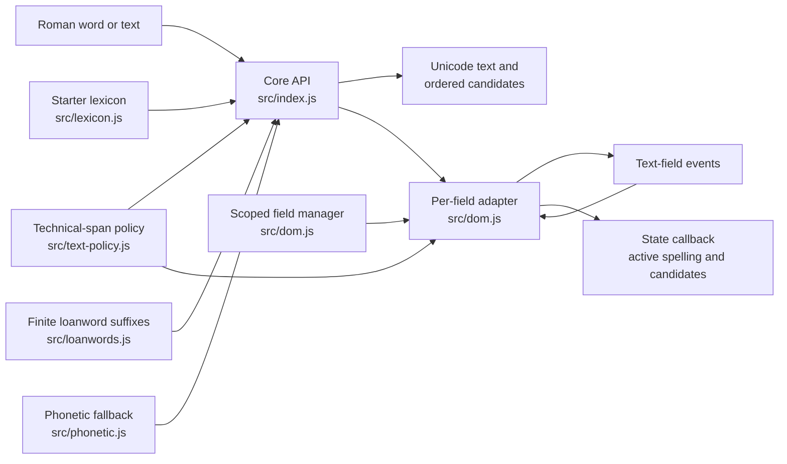

# Architecture

SahajLipi is currently a small, dependency-free **Nepali** transliteration prototype. A pure conversion engine chooses a default Devanagari rendering for Roman input; separate browser adapters apply that engine to configured text fields as the user types. The project name leaves room for other Devanagari languages, but no other language implementation exists today.

This page describes the published `0.1.0-alpha.3` package and its source. The earlier alpha.1 artifact retains its half-consonant fallback. For supported keys and migration examples, see the [typing reference](typing-reference.md) and [integration recipe](integration-recipes.md#keep-alpha1-consonant-behavior). For evaluation methods and dated results, see [benchmarks](benchmarks.md).

## Components and boundaries

```mermaid
flowchart LR
  A[Roman word or text] --> B[Core API<br/>src/index.js]
  L[Starter lexicon<br/>src/lexicon.js] --> B
  S[Finite loanword suffixes<br/>src/loanwords.js] --> B
  P[Phonetic fallback<br/>src/phonetic.js] --> B
  T[Technical-span policy<br/>src/text-policy.js] --> B
  T --> E
  B --> C[Unicode text and<br/>ordered candidates]
  M[Scoped field manager<br/>src/dom.js] --> E[Per-field adapter<br/>src/dom.js]
  D[Text-field events] --> E
  B --> E
  E --> D
  E --> F[State callback<br/>active spelling and candidates]
```

| File | Responsibility |
| --- | --- |
| [`src/index.js`](../../src/index.js) | Public core API; lexicon lookup, explicit shortcut handling, candidate generation, and whole-text conversion. |
| [`src/lexicon.js`](../../src/lexicon.js) | Small, reviewable map of Roman spellings to preferred output and any alternatives. |
| [`src/loanwords.js`](../../src/loanwords.js) | Explicit recognized loanword stem catalogue and finite suffix keys; derive readings from the engine’s own stem entries. |
| [`src/phonetic.js`](../../src/phonetic.js) | Deterministic token-to-Devanagari fallback for words absent from the lexicon. |
| [`src/text-policy.js`](../../src/text-policy.js) | Shared technical-span recognition with UTF-16 offsets, used by whole-text conversion and browser typing. |
| [`src/dom.js`](../../src/dom.js) | Optional text-field integration: scoped discovery and lifecycle, live replacement, caret and active-word state, suggestions, paste, composition, and undo. |
| [`src/index.d.ts`](../../src/index.d.ts), [`src/dom.d.ts`](../../src/dom.d.ts) | TypeScript declarations for the core and browser adapters. |

The core imports the lexicon, loanword-suffix, phonetic, and text-policy modules. It does not access the DOM or make network requests. The browser module uses the default converters unless custom functions are passed, so an independent engine can drive the same input behavior. The package is an ES module with `.` and `./dom` export paths and no runtime dependencies. The experimental alpha **`0.1.0-alpha.2`** was published to npm on 2026-10-03; its registry artifact matches the reviewed release source. See the [release record](../release.md) for verification and distribution status. The core and Node tests support Node.js 18 or newer. The separate browser test toolchain uses a pinned Playwright development dependency and requires Node.js 20 or newer.

## Core conversion flow

[`createEngine({ entries, preserveTechnicalText, digits, consonantMode })`](../../src/index.js) returns an independent object with `convertWord` and `convertText`. Each engine clones the starter lexicon and replaces entries with the same normalized Roman key from `entries`. Each custom value must be a nonempty array of nonempty strings. A word's first value is its default output; later distinct values are alternatives. The module also exports `convertWord` and `convertText` from one default engine instance. Customizing an engine does not alter that default instance. `consonantMode` defaults to `'full'`; `'half'` preserves the alpha.1 fallback endings. This option does not rewrite exact readings or recognized loanword suffix outputs. `preserveTechnicalText` defaults to `true`; setting it to `false` opts that engine’s whole-text converter out of technical-span preservation without changing its single-word converter.

For `convertWord(roman)`, the order is:

1. **Normalize case.** Most capitals become lowercase. Capital `T`, `D`, `S`, and `R` retain distinct sound mappings. `H` remains capital after a Roman vowel so it can represent visarga. This is implemented in [`normalizeRoman`](../../src/phonetic.js).
2. **Try a whole-word lexicon entry.** An exact normalized key wins. Normalization folds incidental capitals and preserves reserved sound capitals (`T`, `D`, `S`, `R`, or vowel-following `H`), so an unrelated lowercase entry cannot override an explicit Shift sound. `Ram` and `Sita` retain their previous readings through explicit built-in aliases; incidental capitalization such as `Garyo` normalizes to its lowercase entry. A custom entry can replace a built-in spelling or add alternatives. The `Ram`/`Sita` aliases inherit customized lowercase readings unless an exact normalized cased override was supplied.
3. **Try a recognized loanword suffix form.** If no exact entry exists and normalization retained no reserved sound capital, match one of the 51 recognized English loanword stems followed by one complete key from the 19-key suffix catalogue. Append its native ending to each stem reading from this engine’s dictionary, in the original order. A custom entry for the complete form wins at step 2; a custom recognized stem changes its derived readings. A custom reading consisting only of ASCII Latin letters retains the Roman suffix, so `company: ['company']` yields literal `companyma`. Other custom readings receive the native ending verbatim, without vowel or virama rewriting; use exact compound entries for specialized morphology. This finite rule does not operate on months, arbitrary custom stems or ordinary Nepali entries.
4. **Handle explicit marks if no whole-word or derived reading exists.** The word is split at `^`, `~`, backtick, `/`, and `=`. Each ordinary segment takes its preferred exact or recognized suffix reading if present, or its phonetic fallback. `^` appends anusvara `ं`; `~` appends chandrabindu `ँ`. Backtick and `/` request virama `्` after a Devanagari consonant or keep an existing trailing virama; otherwise the marker remains literal. `=` inserts zero-width joiner U+200D only immediately after an explicitly requested virama; otherwise it stays literal. A vowel in the next segment is independent, so both `` k`i `` and `k/i` yield क्इ. Segment processing produces one candidate. A whole-word custom entry can still provide alternatives for a spelling containing shortcuts.
5. **Apply the phonetic fallback** when no exact entry, recognized suffix form or explicit-shortcut path applies.
6. **Render digits and deduplicate candidates.** The engine's `digits: 'devanagari'` default maps ASCII `0–9` to `०–९` in every output candidate, including custom-entry outputs and fallback text. `digits: 'latin'` retains ASCII digits. Existing Devanagari digits are unchanged in either style. Duplicate candidate strings are removed after digit rendering without changing their order. The result is `{ text, candidates, ambiguous }`, where `text` is the first candidate and `ambiguous` means more than one distinct candidate exists. Empty input returns empty text and candidates.

The fallback matches the longest available consonant or vowel token at each position ([`src/phonetic.js`](../../src/phonetic.js)). Consecutive consonants join with virama `्`; a following vowel supplies its dependent sign, with no sign for `a`. In the default `'full'` mode, a bare or final consonant is full: `k` and `ka` → `क`, `kr` and `kra` → `क्र`. Internal clusters still form automatically: `kri` → `क्रि` and `shakti` → `शक्ति`; `kar` → `कर` uses `a` to separate the consonants. A vowel not following a consonant emits its independent letter. The `'half'` mode retains the alpha.1 final virama: `k` → `क्` and `kr` → `क्र्`. Explicit half markers are handled separately and remain half across word boundaries in either mode. Characters with no matching token are copied through. These are deterministic character rules, **not** a spelling model.

`convertText(text)` first obtains protected spans from [`findProtectedSpans`](../../src/text-policy.js), which returns UTF-16 ranges for recognizable HTTP(S) and `www.` links, ASCII domain-shaped hosts, ordinary ASCII email addresses, and their unfinished forms once an address cue appears. It copies those ranges literally, including their spelling and case. Outside those ranges, it applies `convertWord` to ASCII Roman-letter and shortcut runs, and maps `|` to danda `।`. The selected digit policy applies only to the converted segments: by default ASCII digits become Devanagari, while `digits: 'latin'` keeps them ASCII. Digits in protected spans are copied literally with the rest of the address. Periods (including decimal points), whitespace, other punctuation, and existing Devanagari pass through. This is a Unicode character substitution, not number parsing or calendar conversion.

The same scanner preserves unfinished forms from `http:`, `https:`, `www.`, an ordinary ASCII local part followed by `@`, or the first ASCII letter after a domain dot. It does not wait for a complete host or email address. Plain `camera` and a trailing sentence period in `camera.` still convert; English mode is needed to keep a fragment literal before any cue. The policy recognizes patterns without network requests, DNS lookups, or public-suffix validation. A dotted spelling such as `pani.paani` is preserved whether or not it is a real domain. It has ASCII scope rather than full internationalized URL/email parsing; arbitrary English and code outside recognized spans remain convertible. `convertWord` still operates on a single Roman word and does not use this policy.

Trailing sentence punctuation and enclosing wrappers sit outside the matched span; balanced parentheses can remain within a URL path. A pipe after a bare domain is outside, while `/`, `?`, or `#` begins a URL suffix whose shortcut characters stay literal. A trailing pipe within such a suffix is therefore literal; whitespace before a sentence danda disambiguates it. The [API reference](api.md#links-domains-and-email-addresses) gives examples and the opt-out behavior.

### Word-level decisions and examples

The [starter lexicon](../../src/lexicon.js) handles spellings that simple phonetic rules would miss. The finite [loanword suffix rule](loanword-suffixes-2026-10-01.md) reuses the listed borrowed stems, so `companyharumathi` derives कम्पनीहरूमाथि and `schoolma` inherits स्कुलमा / स्कूलमा. It concatenates approved spelling components rather than predicting grammar or repairing misspellings. The [four reviewed native-word aliases](nepali-spelling-2026-10-01.md) supply exact vowel/nasal spellings for `halyo`, `nabhani`, `gaunle` and `dindaina`; they create no general correction or native suffix rule. For example, `pani` → `पनि` and `paani` → `पानी` are separate entries; `paryo` → `पर्‍यो` and the [listed ra-ya words](typing-reference.md#र्य-and-र्‍य) use word-specific entries. The [review report](ry-review.md) records their evidence and scope; no general `ry` joiner rule or suffix inference for these native words is applied. `kam` defaults to `कम` and offers `काम` as an alternative. Unrecognized words and unsupported suffix forms fall back to phonetic conversion, which may be readable yet linguistically wrong. There is no context-sensitive candidate ranking or automatic learning.

## Browser input adapters

`attachNepaliInputs(root = document, options?)` creates a manager scoped to a document or container. Its default `scope: 'marked'` selects fields with `data-sahajlipi`; `scope: 'all'` selects every supported text field under that root. A custom `selector` replaces either selection rule. Matching `excludeSelector` fields are left untouched (default `[data-sahajlipi-ignore]`), so an app-wide manager can coexist with English fields on the same page. This is configuration on a manager instance; there is no mutable module-wide setting. Overlapping managers are rejected with `TypeError` to prevent double conversion. A document-wide scan does not enter shadow roots or iframe documents.

The manager attaches one controller per eligible field and watches changes with `MutationObserver`. A scan also removes controllers for fields that no longer qualify. `refresh()` scans on demand, `getController(field)` finds a managed field's controller, and `destroy()` disconnects observation and removes those controllers. `enabled` sets the initial mode of attached fields. `setEnabled(boolean)` updates every current controller and the default for fields added later; `getEnabled()` reads that shared mode. Shared conversion functions can be passed in `options`, and `onStateChange(state, field)` identifies the field behind a state update.

`attachNepaliInput(field, options?)` attaches a single `<textarea>`, `<input type="text">`, or `<input type="search">` and returns a controller with `getState`, `chooseCandidate`, `setEnabled`, `setText`, `insertPunctuation`, `insertMark`, `undo`, `redo`, and `destroy`. The default converters work without options; passing `convertWord` and `convertText` connects a custom engine. `enabled` chooses the initial mode for that one field. Its `onStateChange(state)` callback receives an initial state and later updates. Unsupported field types are ignored by the manager and rejected by the direct API. The adapter does not implement `contenteditable`.

The per-field adapter's **active word** records the Roman keys typed, the start and end of the currently rendered Nepali span, ordered candidates, ambiguity, and whether suggestions were dismissed. When another Roman key arrives at the active span's end, the adapter reconverts the accumulated Roman spelling and replaces that span. This matters because one Roman key can change several Unicode characters; for example, Backspace on an active `ki` removes `i` and rerenders `k` as `क` in the default full mode or `क्` with a half-mode engine. Backtick and `/` belong to the active Roman spelling, so Backspace can remove an explicit half marker. A space or punctuation commits the visible reading, preserving an explicit half form, and clears active-word state. A suggestion is exposed through `onStateChange` only while the active word has distinct alternatives and has not been dismissed. Choosing one replaces that span, keeps the Roman spelling editable, and suppresses candidates until the word changes. A host interface can render those candidates and connect its own controls to the returned controller.

Separately, the adapter keeps the original input of the current whitespace-delimited token during uninterrupted typing, with its rendered range. That token lets it restore letters and digits previously shown as Nepali as soon as an early address cue appears, then retain the unfinished address in Roman text. Backspacing away the cue lets ordinary conversion resume. The same scanner is used by bulk conversion and pasted text, so there is no separate browser-only definition of an address. Committed Nepali text cannot be reconstructed into its original Roman spelling.

### Event paths and editing state

| Event path | Current behavior |
| --- | --- |
| Cancelable `beforeinput` | Intercepts text insertion, deletion, and history operations. It inserts line breaks only in textareas; Enter keeps its native behavior in single-line inputs. Roman letters and shortcuts update the active word and raw token in Nepali mode; digits use the engine policy and recognized technical spans render literally. English mode inserts text literally. |
| Native `input` fallback | Compares previous and current field values to locate an insertion when `beforeinput` did not handle it, then uses the same insertion and technical-span policy to rerender it. |
| `paste` and `cut` | Paste converts the pasted text with the same technical-span policy in Nepali mode and inserts it at the selection; English mode keeps it literal. Cut copies the selected plain text and removes that range. |
| `compositionstart` / `compositionend` | Leaves the browser's composition process alone, then defers conversion to the next event-loop turn to allow a final input event and applies the shared text policy; simulated tests cover selected mobile event sequences. |
| `keydown` and `selectionchange` | Handles Ctrl/Cmd+Z, Ctrl/Cmd+Y or Shift+Z, Alt+1–9 candidate selection, Escape dismissal, and cancellation of active-word state when the caret moves away. |

The adapter stores value, selection, active-word, and current-token snapshots for undo and redo; its own history is capped at 200 snapshots. It dispatches a synthetic bubbling `input` event after programmatic replacements so ordinary listeners see the converted value, and guards against handling its own event twice. `setEnabled(false)` affects subsequent typing; it does not reverse already converted text. `destroy()` removes the listeners. These paths are in [`src/dom.js`](../../src/dom.js).

## Unicode and caret handling

Devanagari half forms are encoded with a consonant and virama U+094D. Their visible form depends on the font and renderer, as explained in the [Unicode Indic FAQ](https://www.unicode.org/faq/indic.html). SahajLipi uses virama for internal fallback conjuncts and explicit backtick or `/` half forms; the `'half'` compatibility mode also retains it on bare and final fallback consonants. An explicit backtick followed by `=` or `/=` inserts zero-width joiner U+200D after the virama when a half-form shape is needed. The built-in `paryo` entry includes that joiner: `पर्‍यो`. The visible glyph shape may still vary with rendering environment.

Text-field selections and replacement ranges use JavaScript string indices, which correspond to UTF-16 code-unit offsets. For Backspace and Delete outside the active Roman word, the adapter uses `Intl.Segmenter` with grapheme granularity when available so a displayed cluster is deleted as a unit. When `Intl.Segmenter` is unavailable, it falls back to Unicode code-point stepping; that fallback does **not** guarantee full grapheme deletion for every Devanagari cluster. See [Unicode Standard Annex #29](https://www.unicode.org/reports/tr29/) for grapheme boundaries. The adapter's event design follows the browser [`beforeinput`/`input` model](https://www.w3.org/TR/input-events-2/), but platform event sequences can differ.

## Verification and current limits

Run `npm test` to execute the Node built-in test runner. [`test/engine.test.js`](../../test/engine.test.js) covers lexicon and fallback conversion, shifted sounds, half consonants, explicit marks, punctuation, candidates, and custom entries. [`test/ry.test.js`](../../test/ry.test.js) adds exact word-specific joiner forms, ordinary-conjunct controls, vowel distinctions, and reserved Shift lookup checks. The [single-field adapter tests](../../test/dom.test.js) and [multi-field integration tests](../../test/dom-manager.test.js) exercise simulated editing, suggestions, paste, input types, dynamic field discovery, teardown, native-input fallback, and composition. The [mixed-text core tests](../../test/mixed-text.test.js) cover recognized address shapes, punctuation boundaries, custom entries, and the engine opt-out; [mixed-text adapter tests](../../test/dom-mixed-text.test.js) cover live editing and event paths. [CI](../../.github/workflows/ci.yml) runs the suite on Node 18, 20, 22, and 24. The [loanword suffix tests](../../test/loanword-suffixes.test.js) cover the finite stem/ending catalogue, inherited candidates, custom whole-form priority, Shift keys and unsupported boundaries; their [dated review](loanword-suffixes-2026-10-01.md) discloses intentional contract revisions. These are regression tests, not a linguistic quality benchmark. A separate [browser suite](browser-compatibility.md) exercises real desktop-engine keyboard and MutationObserver flows through the demo and a dedicated fixture, with injected clipboard/composition/fallback cases labeled separately. Its [workflow](../../.github/workflows/browser.yml) records per-engine reports; see the compatibility guide for tested versions, environments, and limits.

Current limits to account for in integrations and evaluations:

- The lexicon is small and manually curated. The suffix rule covers only its 51 recognized loanword stems and 19 finite keys; every generated pair is not separately source-attested. Unknown words, names, English text, and informal Roman spellings can convert incorrectly.
- Technical-span preservation uses ASCII pattern cues and accepts unfinished addresses; it does not infer the intent of plain Roman letters before a cue. It does not check whether a domain exists, fully parse internationalized addresses, or identify arbitrary English or code.
- Candidate order is the supplied lexicon order. There is no statistical ranking, sentence context, or automatic correction.
- The DOM adapter supports textareas and text/search inputs. Selected desktop-engine flows have a [recorded compatibility run](browser-compatibility.md#recorded-run--2026-09-27). Mobile composition has simulated tests, while real device keyboards, installed IMEs, OS clipboard behavior, and assistive technology remain unverified. `contenteditable` and other input types remain unsupported.
- The seed [benchmark](benchmarks.md) checks named behavior contracts and separately reports exploratory cases. There is no independently reviewed real-typing corpus or population-wide accuracy estimate yet.
- Only Nepali mappings are implemented. The published `0.1.0-alpha.2` remains experimental; registry distribution does not complete independent linguistic, physical mobile, or framework-controlled field review.
